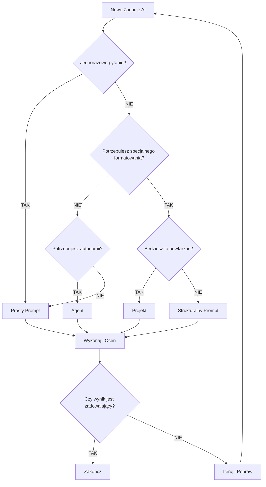
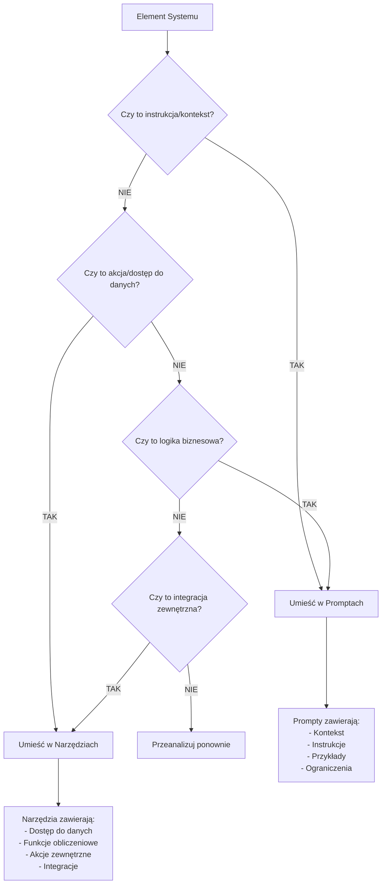
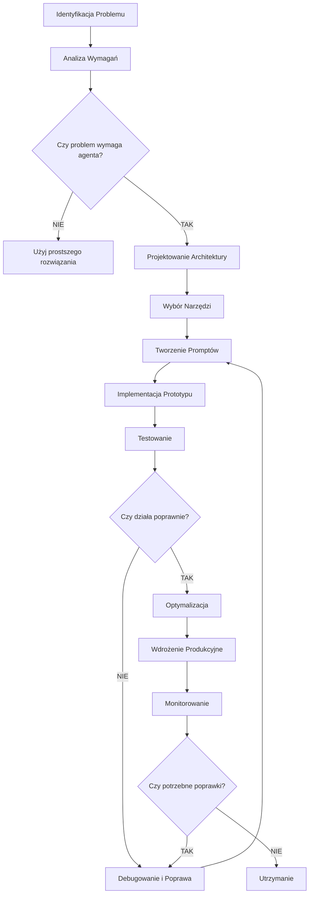
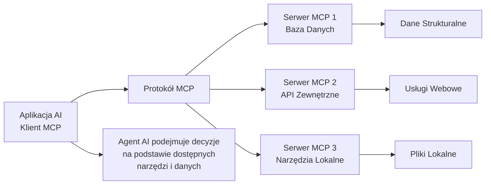

# Przewodnik po Budowaniu Systemów Opartych o AI Agenta

## Spis Treści
1. [Wprowadzenie do AI Agentów](#wprowadzenie)
2. [Model Context Protocol (MCP)](#mcp)
3. [Prompt Engineering dla AI Agentów](#prompt-engineering)
4. [Framework Decyzyjny: Kiedy Używać Czego](#framework-decyzyjny)
5. [Architektura Systemów Agentowych](#architektura)
6. [Najlepsze Praktyki](#najlepsze-praktyki)
7. [Diagramy Decyzyjne](#diagramy-decyzyjne)

## Wprowadzenie do AI Agentów {#wprowadzenie}

### Czym są AI Agenci?

AI Agenci to systemy, które używają narzędzi do wykonywania zadań w sposób ciągły i autonomiczny. W przeciwieństwie do podstawowych interakcji z promptami, AI agenci integrują informacje zwrotne ze swojego środowiska, podejmując decyzje na podstawie zebranych informacji.

**Kluczowe cechy AI Agentów:**
- **Autonomia w zadaniach**: Agenci otrzymują zadanie i, używając różnych narzędzi, pracują niezależnie nad jego wykonaniem
- **Środowisko i narzędzia**: Agent działa w określonym środowisku wyposażonym w narzędzia niezbędne do wykonania zadania
- **Ciągłe uczenie się**: Wykorzystują feedback z otoczenia do podejmowania lepszych decyzji

### Kiedy Używać AI Agentów?

Nie wszystkie zadania wymagają zaawansowania agentów. Oto lista kontrolna:

1. **Złożoność zadania**: Czy zadanie jest na tyle skomplikowane, że krok po kroku podejście człowieka nie jest jasne?
2. **Wartościowe rezultaty**: Czy zadanie może przynieść znaczną wartość (generowanie przychodów, poprawa doświadczenia użytkownika)?
3. **Wykonalność**: Czy możesz zdefiniować i dostarczyć niezbędne narzędzia lub informacje dla agenta?
4. **Wpływ błędów**: Jakie są konsekwencje błędów? Jeśli błąd jest kosztowny lub trudny do naprawienia, lepiej zachować człowieka w pętli.

### Przykłady Efektywnych Przypadków Użycia

1. **Projekty kodowania**: Przekształcanie dokumentu projektowego w pull request
2. **Procesy wyszukiwania**: Scenariusze gdzie wyszukiwania można poprawić przez cytowania lub sprawdzanie wyników
3. **Analiza danych**: Wyciąganie wniosków z różnorodnych zestawów danych o nieprzewidywalnych formatach

## Model Context Protocol (MCP) {#mcp}

### Czym jest MCP?

Model Context Protocol (MCP) to otwarty standard łączenia aplikacji AI z zewnętrznymi systemami. MCP umożliwia aplikacjom AI jak Claude czy ChatGPT łączenie się ze źródłami danych (np. lokalne pliki, bazy danych), narzędziami (np. wyszukiwarki, kalkulatory) i przepływami pracy (np. specjalistyczne prompty).

**MCP można porównać do portu USB-C dla aplikacji AI** - tak jak USB-C zapewnia standardowy sposób łączenia urządzeń elektronicznych, MCP zapewnia standardowy sposób łączenia aplikacji AI z zewnętrznymi systemami.

### Korzyści MCP

**Dla deweloperów:**
- Zmniejsza czas rozwoju i złożoność przy budowaniu lub integrowaniu z aplikacją AI lub agentem

**Dla aplikacji AI lub agentów:**
- Zapewnia dostęp do ekosystemu źródeł danych, narzędzi i aplikacji, które zwiększą możliwości i poprawią doświadczenie użytkownika końcowego

**Dla użytkowników końcowych:**
- Rezultatem są bardziej zdolne aplikacje AI lub agenci, które mogą uzyskać dostęp do danych i podejmować działania w ich imieniu gdy to konieczne

### Architektura MCP

MCP składa się z trzech głównych komponentów:

1. **Serwery MCP**: Udostępniają dane, narzędzia i prompty
2. **Klienci MCP**: Aplikacje AI, które łączą się z serwerami
3. **Protokół komunikacji**: Standardowy interfejs między klientami a serwerami

### Przykłady Zastosowań MCP

- Agenci mogą uzyskać dostęp do Google Calendar i Notion, działając jako bardziej spersonalizowany asystent AI
- Claude Code może wygenerować całą aplikację webową używając projektu Figma
- Chatboty korporacyjne mogą łączyć się z wieloma bazami danych w organizacji
- Modele AI mogą tworzyć projekty 3D w Blenderze i drukować je na drukarce 3D

## Prompt Engineering dla AI Agentów {#prompt-engineering}

### Czym jest Prompt Engineering?

Prompt engineering to sztuka i nauka tworzenia skutecznych instrukcji dla dużych modeli językowych jak Claude, aby uzyskać pożądane wyniki. W swojej istocie, prompt engineering polega na projektowaniu, udoskonalaniu i optymalizowaniu tekstowych wejść (promptów) podawanych modelom, aby wywołać dokładne, istotne i użyteczne odpowiedzi.

### Różnica między Podstawowym Promptowaniem a Prompt Engineering

**Podstawowe promptowanie:**
- Często obejmuje interakcje jednokierunkowe z prostymi zapytaniami
- Może być niejasne lub dwuznaczne, prowadząc do niespójnych wyników
- Jednorazowa aktywność

**Prompt Engineering:**
- Może obejmować wielokierunkowe rozmowy, złożone instrukcje i starannie ustrukturyzowane wejścia i wyjścia
- Precyzyjne, pozostawiające mało miejsca na błędną interpretację przez model
- Systematyczne testowanie, analiza i poprawa promptów w czasie
- Skalowalne - tworzy prompty, które mogą obsłużyć szeroki zakres wejść i przypadków użycia

### Najlepsze Praktyki Promptowania Agentów

1. **Myśl jak Twój Agent**: Stwórz mentalny model środowiska i zadań agenta
2. **Zdefiniuj Rozsądne Heurystyki**: Kierowanie agentami jasnymi, praktycznymi heurystykami pomaga kształtować ich procesy decyzyjne
3. **Wybór Narzędzi jest Kluczowy**: Określ, które narzędzia agent powinien wykorzystać do różnych zadań
4. **Planuj i Reflektuj**: Zachęć agentów do planowania działań przed wykonaniem
5. **Uważaj na Niezamierzone Skutki Uboczne**: Zmiany w promptach mogą prowadzić do nieprzewidywalnych rezultatów
6. **Zarządzaj Oknami Kontekstu**: Strategie jak kompresja - podsumowywanie nadmiernego kontekstu

### Struktura Skutecznego Promptu

```
ROLA: Skupia uwagę AI (np. "Jesteś najlepszym analitykiem finansowym na świecie")
CEL: Co chcesz osiągnąć
ZADANIE: Instrukcje krok po kroku
KONTEKST: Informacje tła i dokumenty
FORMAT WYJŚCIA: Dokładnie jak chcesz otrzymać wyniki
```

### Przykład Strukturalnego Promptu

```
ROLA: Jesteś ekspertem od analizy danych finansowych z 15-letnim doświadczeniem w analizie spółek technologicznych.

CEL: Przeanalizować kondycję finansową spółki XYZ i określić czy jest to dobra inwestycja długoterminowa.

ZADANIE:
1. Przeanalizuj załączone sprawozdania finansowe z ostatnich 3 lat
2. Porównaj kluczowe wskaźniki z konkurencją w branży
3. Oceń trendy wzrostu przychodów i rentowności
4. Zidentyfikuj główne ryzyka i możliwości
5. Sformułuj rekomendację inwestycyjną

KONTEKST: 
- Analizujemy dla konserwatywnego funduszu inwestycyjnego
- Preferujemy spółki o stabilnych przychodach i niskim ryzyku
- Horyzont inwestycyjny: 5-10 lat

FORMAT WYJŚCIA:
- Podsumowanie wykonawcze (max 200 słów)
- Analiza finansowa (tabela z kluczowymi wskaźnikami)
- Ocena ryzyk (lista punktowana)
- Rekomendacja (KUP/TRZYMAJ/SPRZEDAJ) z uzasadnieniem
```

## Framework Decyzyjny: Kiedy Używać Czego {#framework-decyzyjny}

### Cztery Poziomy Interakcji z AI

#### Poziom 1: Proste Prompty - Twoja AI Wyszukiwarka Google

**Kiedy używać:**
- Burza mózgów lub zadawanie jednorazowych pytań
- Potrzebujesz szybkiej odpowiedzi bez specjalnego formatowania
- Eksplorujesz temat lub schodzisz w królicze nory
- Zadanie jest izolowane i nie będzie powtarzane

**Przykład:**
```
Wyjaśnij upadek Cesarstwa Rzymskiego
```

#### Poziom 2: Strukturalne Prompty - Instrukcje dla Stażysty

**Kiedy używać:**
- Masz wieloczęściowe zadania lub potrzebujesz sformatowanego wyjścia
- Zadanie obejmuje odwoływanie się do wielu dokumentów
- Potrzebujesz specjalnego formatowania wyjścia
- Jest złożone, ale niekoniecznie powtarzalne codziennie

**Przykład:**
```
ROLA: Jesteś ekspertem od marketingu cyfrowego
ZADANIE: Stwórz strategię marketingową dla nowego produktu
KONTEKST: [załącz dokumenty o produkcie]
FORMAT: Plan w punktach z budżetem i harmonogramem
```

#### Poziom 3: Projekty - Asystent Powtarzalnych Przepływów Pracy

**Kiedy używać:**
- Potrzebujesz przewidywalnych wyników za każdym razem
- Zadanie jest powtarzalne, ale może wymagać okazjonalnych poprawek
- Regularnie wymieniasz przykładowe dokumenty lub kontekst
- Kontrola i przejrzystość mają znaczenie

**Przykład zastosowania:**
Projekt generujący notatki z podcastu co tydzień - wklejasz notatki, otrzymujesz sformatowane notatki gotowe do skopiowania.

#### Poziom 4: Agenci - Autonomiczni Rozwiązywacze Problemów

**Kiedy używać:**
- Zadanie wymaga autonomii i dynamicznego podejmowania decyzji
- Nie możesz nadzorować procesu
- Wiele narzędzi musi współpracować (wyszukiwanie w sieci, tworzenie dokumentów itp.)
- Ścieżka do celu nie jest przewidywalna

**Przykład:**
Agent, który codziennie rano przeszukuje internet w poszukiwaniu wiadomości AI z ostatnich 12 godzin.

### Drzewo Decyzyjne



## Architektura Systemów Agentowych {#architektura}

### Pojedynczy Agent + Narzędzia

**Komponenty:**
- Jeden autonomiczny AI agent
- Wiele zewnętrznych narzędzi
- Model językowy jako "mózg" lub silnik rozumowania

**Kiedy używać:**
- Zadania wymagające różnorodnych narzędzi
- Gdy jeden agent może obsłużyć całą złożoność
- Prostsze w zarządzaniu niż systemy multi-agentowe

### Multi-Agent Systems

**Komponenty:**
- Wiele wyspecjalizowanych agentów
- System orkiestracji
- Mechanizmy komunikacji między agentami

**Kiedy używać:**
- Bardzo złożone zadania wymagające specjalizacji
- Gdy różne części zadania wymagają różnych ekspertyz
- Potrzeba równoległego przetwarzania

### Architektura Hybrydowa

**Komponenty:**
- Kombinacja pojedynczych agentów i systemów multi-agentowych
- Elastyczne przełączanie między trybami
- Adaptacyjna orkiestracja

## Najlepsze Praktyki {#najlepsze-praktyki}

### Projektowanie Promptów

1. **Zacznij od Prostego**
   - Napisz najprostszy prompt najpierw
   - Zobacz co wychodzi, potem iteruj
   - Dodawaj złożoność stopniowo

2. **Bądź Precyzyjny**
   - Unikaj dwuznacznego języka
   - Używaj konkretnych instrukcji
   - Definiuj oczekiwane formaty wyjścia

3. **Testuj i Iteruj**
   - Testuj prompty w regularnych chatach najpierw
   - Udoskonalaj do 90-95% niezawodności
   - Dopiero potem przenoś do projektów

### Zarządzanie Narzędziami vs Prompty

#### Co umieścić w Promptach:
- **Kontekst i tło**: Informacje o firmie, branży, celach
- **Instrukcje procesowe**: Jak wykonać zadanie krok po kroku
- **Przykłady**: Pokazanie pożądanego formatu wyjścia
- **Ograniczenia**: Co agent nie powinien robić
- **Kryteria oceny**: Jak ocenić jakość wyniku

#### Co umieścić w Narzędziach:
- **Dostęp do danych**: Bazy danych, API, pliki
- **Funkcje obliczeniowe**: Kalkulatory, analizatory
- **Akcje zewnętrzne**: Wysyłanie emaili, tworzenie plików
- **Integracje**: Połączenia z innymi systemami
- **Weryfikacja**: Sprawdzanie faktów, walidacja danych

### Przykład Podziału: System Analizy Finansowej

**W Promptach:**
```
ROLA: Jesteś analitykiem finansowym z certyfikatem CFA
PROCES: 
1. Pobierz dane finansowe za ostatnie 3 lata
2. Oblicz kluczowe wskaźniki (ROE, ROA, P/E, debt-to-equity)
3. Porównaj z benchmarkami branżowymi
4. Zidentyfikuj trendy i anomalie
5. Sformułuj rekomendację

KRYTERIA OCENY:
- Dokładność obliczeń (sprawdź dwukrotnie)
- Kompletność analizy (wszystkie wymagane wskaźniki)
- Jakość uzasadnienia rekomendacji
```

**W Narzędziach:**
- Narzędzie dostępu do bazy danych finansowych
- Kalkulator wskaźników finansowych
- API do danych benchmarkowych
- Generator raportów PDF
- System weryfikacji obliczeń

### Bezpieczeństwo i Prywatność

1. **Minimalizuj Dostęp**
   - Czy agent naprawdę potrzebuje dostępu do Google Drive?
   - Używaj "czystych" kont specjalnie dla AI

2. **Weryfikuj Wyniki**
   - Zawsze sprawdzaj linki i fakty
   - Kliknij w linki, aby zweryfikować informacje
   - Naucz się mocnych i słabych stron konkretnego modelu

3. **Kontroluj Koszty**
   - Tokeny agentów są drogie
   - Modele rozumujące "myślą" przed odpowiedzią
   - Monitoruj użycie i ustaw limity

### Ocena Wydajności Agentów

1. **Używaj Realistycznych Zadań**
   - Zadania oceny powinny odzwierciedlać rzeczywiste scenariusze
   - Testuj na różnorodnych przypadkach użycia

2. **Wykorzystuj LLM do Oceny**
   - Modele językowe mogą oceniać wyniki według ustalonych rubryk
   - Pozwala na bardziej niuansowaną ocenę wydajności agenta

3. **Sprawdzaj Stany Końcowe**
   - Potwierdź, że agent poprawnie wykonuje zadania
   - Sprawdź czy osiąga pożądany stan końcowy

## Diagramy Decyzyjne {#diagramy-decyzyjne}

### Diagram 1: Wybór Poziomu Interakcji z AI


### Diagram 2: Podział Prompt vs Narzędzia



### Diagram 3: Proces Rozwoju Agenta



### Diagram 4: Architektura MCP



## Podsumowanie

Budowanie skutecznych systemów opartych o AI agenta wymaga przemyślanego podejścia do:

1. **Wyboru odpowiedniego poziomu złożoności** - nie komplikuj bez potrzeby
2. **Właściwego podziału między prompty a narzędzia** - kontekst w promptach, akcje w narzędziach
3. **Iteracyjnego rozwoju** - zacznij prosto, testuj, poprawiaj
4. **Zarządzania bezpieczeństwem i kosztami** - kontroluj dostęp i monitoruj użycie

Model Context Protocol (MCP) stanowi fundament dla skalowalnych systemów agentowych, umożliwiając standardowe połączenia między AI a zewnętrznymi systemami.

Prompt engineering pozostaje kluczową umiejętnością - to sztuka komunikacji z AI w sposób, który maksymalizuje zrozumienie i wydajność modelu przy danym zadaniu.

Pamiętaj: najlepsze rozwiązanie AI to to, które wykonuje pracę - nie to z największą liczbą ruchomych części.
