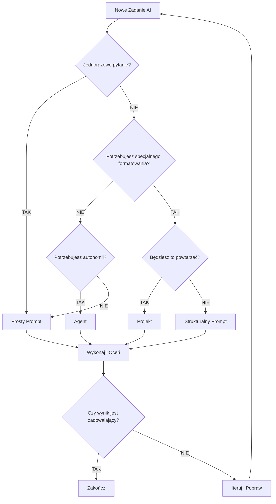
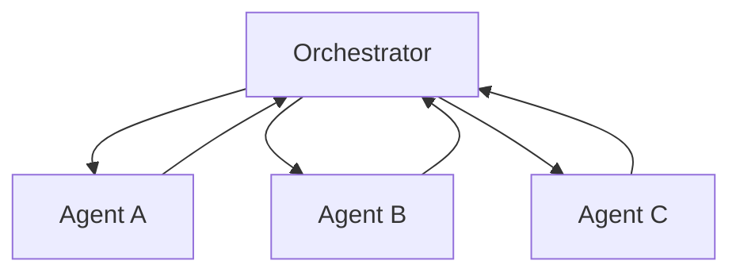
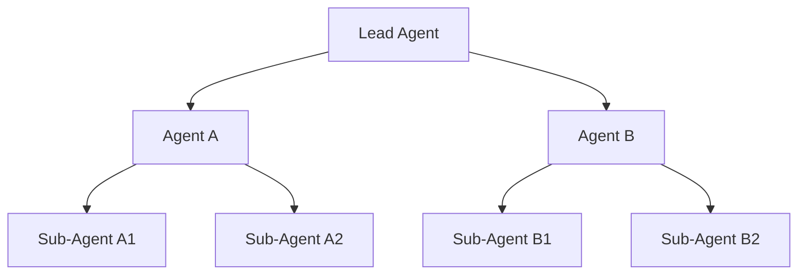
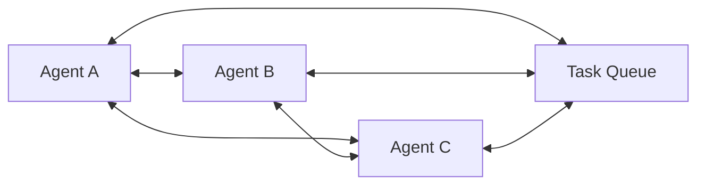
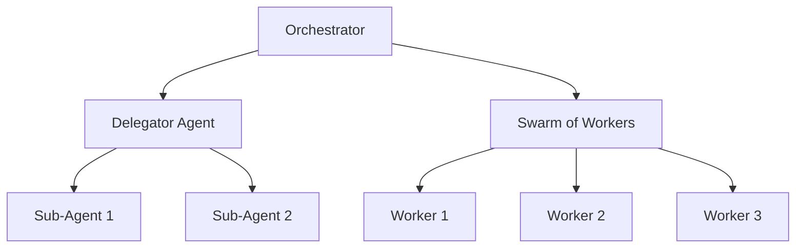
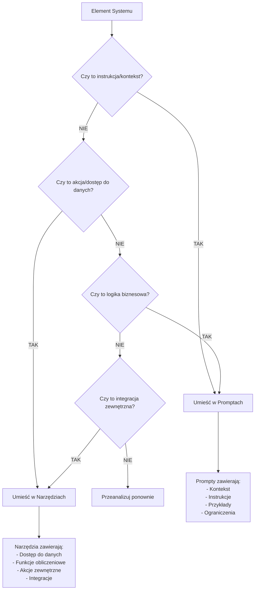
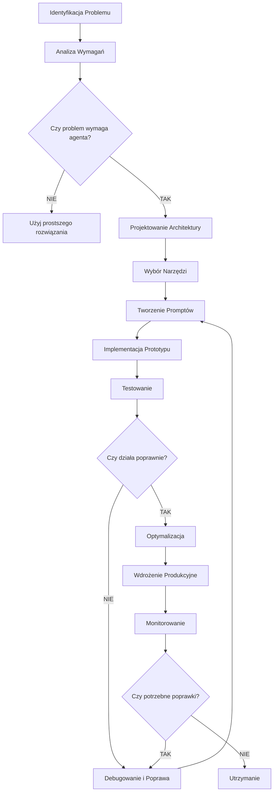
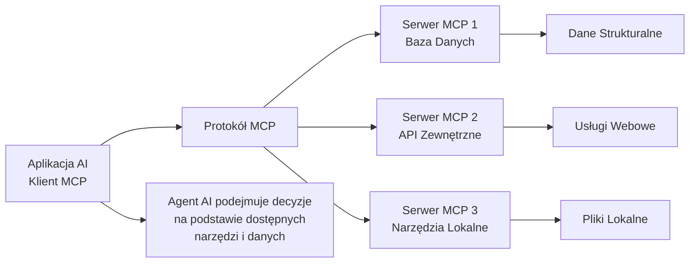

# Przewodnik po Budowaniu Systemów Opartych o AI Agenta

## Spis Treści
1. [Wprowadzenie do AI Agentów](#wprowadzenie)
2. [Model Context Protocol (MCP)](#mcp)
3. [Prompt Engineering dla AI Agentów](#prompt-engineering)
4. [Framework Decyzyjny: Kiedy Używać Czego](#framework-decyzyjny)
5. [Architektura Systemów Agentowych](#architektura)
6. [Najlepsze Praktyki](#najlepsze-praktyki)
7. [Diagramy Decyzyjne](#diagramy-decyzyjne)

## Wprowadzenie do AI Agentów {#wprowadzenie}

### Czym są AI Agenci?

AI Agenci to systemy, które używają narzędzi do wykonywania zadań w sposób ciągły i autonomiczny. W przeciwieństwie do podstawowych interakcji z promptami, AI agenci integrują informacje zwrotne ze swojego środowiska, podejmując decyzje na podstawie zebranych informacji.

**Kluczowe cechy AI Agentów:**
- **Autonomia w zadaniach**: Agenci otrzymują zadanie i, używając różnych narzędzi, pracują niezależnie nad jego wykonaniem
- **Środowisko i narzędzia**: Agent działa w określonym środowisku wyposażonym w narzędzia niezbędne do wykonania zadania
- **Ciągłe uczenie się**: Wykorzystują feedback z otoczenia do podejmowania lepszych decyzji

### Kiedy Używać AI Agentów?

Nie wszystkie zadania wymagają zaawansowania agentów. Oto lista kontrolna:

1. **Złożoność zadania**: Czy zadanie jest na tyle skomplikowane, że krok po kroku podejście człowieka nie jest jasne?
2. **Wartościowe rezultaty**: Czy zadanie może przynieść znaczną wartość (generowanie przychodów, poprawa doświadczenia użytkownika)?
3. **Wykonalność**: Czy możesz zdefiniować i dostarczyć niezbędne narzędzia lub informacje dla agenta?
4. **Wpływ błędów**: Jakie są konsekwencje błędów? Jeśli błąd jest kosztowny lub trudny do naprawienia, lepiej zachować człowieka w pętli.

### Przykłady Efektywnych Przypadków Użycia

1. **Projekty kodowania**: Przekształcanie dokumentu projektowego w pull request
2. **Procesy wyszukiwania**: Scenariusze gdzie wyszukiwania można poprawić przez cytowania lub sprawdzanie wyników
3. **Analiza danych**: Wyciąganie wniosków z różnorodnych zestawów danych o nieprzewidywalnych formatach

## Model Context Protocol (MCP) {#mcp}

### Czym jest MCP?

Model Context Protocol (MCP) to otwarty standard łączenia aplikacji AI z zewnętrznymi systemami. MCP umożliwia aplikacjom AI jak Claude czy ChatGPT łączenie się ze źródłami danych (np. lokalne pliki, bazy danych), narzędziami (np. wyszukiwarki, kalkulatory) i przepływami pracy (np. specjalistyczne prompty).

**MCP można porównać do portu USB-C dla aplikacji AI** - tak jak USB-C zapewnia standardowy sposób łączenia urządzeń elektronicznych, MCP zapewnia standardowy sposób łączenia aplikacji AI z zewnętrznymi systemami.

### Korzyści MCP

**Dla deweloperów:**
- Zmniejsza czas rozwoju i złożoność przy budowaniu lub integrowaniu z aplikacją AI lub agentem

**Dla aplikacji AI lub agentów:**
- Zapewnia dostęp do ekosystemu źródeł danych, narzędzi i aplikacji, które zwiększą możliwości i poprawią doświadczenie użytkownika końcowego

**Dla użytkowników końcowych:**
- Rezultatem są bardziej zdolne aplikacje AI lub agenci, które mogą uzyskać dostęp do danych i podejmować działania w ich imieniu gdy to konieczne

### Architektura MCP

MCP składa się z trzech głównych komponentów:

1. **Serwery MCP**: Udostępniają dane, narzędzia i prompty
2. **Klienci MCP**: Aplikacje AI, które łączą się z serwerami
3. **Protokół komunikacji**: Standardowy interfejs między klientami a serwerami

### Przykłady Zastosowań MCP

- Agenci mogą uzyskać dostęp do Google Calendar i Notion, działając jako bardziej spersonalizowany asystent AI
- Claude Code może wygenerować całą aplikację webową używając projektu Figma
- Chatboty korporacyjne mogą łączyć się z wieloma bazami danych w organizacji
- Modele AI mogą tworzyć projekty 3D w Blenderze i drukować je na drukarce 3D

## Prompt Engineering dla AI Agentów {#prompt-engineering}

### Czym jest Prompt Engineering?

Prompt engineering to sztuka i nauka tworzenia skutecznych instrukcji dla dużych modeli językowych jak Claude, aby uzyskać pożądane wyniki. W swojej istocie, prompt engineering polega na projektowaniu, udoskonalaniu i optymalizowaniu tekstowych wejść (promptów) podawanych modelom, aby wywołać dokładne, istotne i użyteczne odpowiedzi.

### Różnica między Podstawowym Promptowaniem a Prompt Engineering

**Podstawowe promptowanie:**
- Często obejmuje interakcje jednokierunkowe z prostymi zapytaniami
- Może być niejasne lub dwuznaczne, prowadząc do niespójnych wyników
- Jednorazowa aktywność

**Prompt Engineering:**
- Może obejmować wielokierunkowe rozmowy, złożone instrukcje i starannie ustrukturyzowane wejścia i wyjścia
- Precyzyjne, pozostawiające mało miejsca na błędną interpretację przez model
- Systematyczne testowanie, analiza i poprawa promptów w czasie
- Skalowalne - tworzy prompty, które mogą obsłużyć szeroki zakres wejść i przypadków użycia

### Najlepsze Praktyki Promptowania Agentów

1. **Myśl jak Twój Agent**: Stwórz mentalny model środowiska i zadań agenta
2. **Zdefiniuj Rozsądne Heurystyki**: Kierowanie agentami jasnymi, praktycznymi heurystykami pomaga kształtować ich procesy decyzyjne
3. **Wybór Narzędzi jest Kluczowy**: Określ, które narzędzia agent powinien wykorzystać do różnych zadań
4. **Planuj i Reflektuj**: Zachęć agentów do planowania działań przed wykonaniem
5. **Uważaj na Niezamierzone Skutki Uboczne**: Zmiany w promptach mogą prowadzić do nieprzewidywalnych rezultatów
6. **Zarządzaj Oknami Kontekstu**: Strategie jak kompresja - podsumowywanie nadmiernego kontekstu

### Struktura Skutecznego Promptu

```
ROLA: Skupia uwagę AI (np. "Jesteś najlepszym analitykiem finansowym na świecie")
CEL: Co chcesz osiągnąć
ZADANIE: Instrukcje krok po kroku
KONTEKST: Informacje tła i dokumenty
FORMAT WYJŚCIA: Dokładnie jak chcesz otrzymać wyniki
```

### Przykład Strukturalnego Promptu

```
ROLA: Jesteś ekspertem od analizy danych finansowych z 15-letnim doświadczeniem w analizie spółek technologicznych.

CEL: Przeanalizować kondycję finansową spółki XYZ i określić czy jest to dobra inwestycja długoterminowa.

ZADANIE:
1. Przeanalizuj załączone sprawozdania finansowe z ostatnich 3 lat
2. Porównaj kluczowe wskaźniki z konkurencją w branży
3. Oceń trendy wzrostu przychodów i rentowności
4. Zidentyfikuj główne ryzyka i możliwości
5. Sformułuj rekomendację inwestycyjną

KONTEKST: 
- Analizujemy dla konserwatywnego funduszu inwestycyjnego
- Preferujemy spółki o stabilnych przychodach i niskim ryzyku
- Horyzont inwestycyjny: 5-10 lat

FORMAT WYJŚCIA:
- Podsumowanie wykonawcze (max 200 słów)
- Analiza finansowa (tabela z kluczowymi wskaźnikami)
- Ocena ryzyk (lista punktowana)
- Rekomendacja (KUP/TRZYMAJ/SPRZEDAJ) z uzasadnieniem
```

## Framework Decyzyjny: Kiedy Używać Czego {#framework-decyzyjny}

### Cztery Poziomy Interakcji z AI

#### Poziom 1: Proste Prompty - Twoja AI Wyszukiwarka Google

**Kiedy używać:**
- Burza mózgów lub zadawanie jednorazowych pytań
- Potrzebujesz szybkiej odpowiedzi bez specjalnego formatowania
- Eksplorujesz temat lub schodzisz w królicze nory
- Zadanie jest izolowane i nie będzie powtarzane

**Przykład:**
```
Wyjaśnij upadek Cesarstwa Rzymskiego
```

#### Poziom 2: Strukturalne Prompty - Instrukcje dla Stażysty

**Kiedy używać:**
- Masz wieloczęściowe zadania lub potrzebujesz sformatowanego wyjścia
- Zadanie obejmuje odwoływanie się do wielu dokumentów
- Potrzebujesz specjalnego formatowania wyjścia
- Jest złożone, ale niekoniecznie powtarzalne codziennie

**Przykład:**
```
ROLA: Jesteś ekspertem od marketingu cyfrowego
ZADANIE: Stwórz strategię marketingową dla nowego produktu
KONTEKST: [załącz dokumenty o produkcie]
FORMAT: Plan w punktach z budżetem i harmonogramem
```

#### Poziom 3: Projekty - Asystent Powtarzalnych Przepływów Pracy

**Kiedy używać:**
- Potrzebujesz przewidywalnych wyników za każdym razem
- Zadanie jest powtarzalne, ale może wymagać okazjonalnych poprawek
- Regularnie wymieniasz przykładowe dokumenty lub kontekst
- Kontrola i przejrzystość mają znaczenie

**Przykład zastosowania:**
Projekt generujący notatki z podcastu co tydzień - wklejasz notatki, otrzymujesz sformatowane notatki gotowe do skopiowania.

#### Poziom 4: Agenci - Autonomiczni Rozwiązywacze Problemów

**Kiedy używać:**
- Zadanie wymaga autonomii i dynamicznego podejmowania decyzji
- Nie możesz nadzorować procesu
- Wiele narzędzi musi współpracować (wyszukiwanie w sieci, tworzenie dokumentów itp.)
- Ścieżka do celu nie jest przewidywalna

**Przykład:**
Agent, który codziennie rano przeszukuje internet w poszukiwaniu wiadomości AI z ostatnich 12 godzin.

### Drzewo Decyzyjne



## Architektura Systemów Agentowych {#architektura}

### Wzorce Architektoniczne

#### 1. Coordinator Pattern (Centralny Orkiestrator)

**Struktura:** Jeden orkiestrator zarządza wszystkimi agentami, podejmuje decyzje o tym co i kiedy uruchomić.



**Kiedy używać:**
- Liniowe workflow (krok 1 → krok 2 → krok 3)
- Proste logiki routingu
- Potrzeba centralnego zarządzania stanem
- Łatwe debugowanie

**Przykład:** System obsługi klienta
```python
class SupportOrchestrator:
    def handle_ticket(self, ticket):
        urgency = self.classifier_agent.classify(ticket)
        
        if urgency == "high":
            response = self.priority_agent.handle(ticket)
        else:
            response = self.standard_agent.handle(ticket)
            
        if self.qa_agent.approve(response):
            return response
        else:
            return self.escalation_agent.escalate(ticket)
```

**Zalety:** Prosty model mentalny, łatwe debugowanie, jasne zarządzanie stanem
**Wady:** Single point of failure, nie skaluje się do złożonych zależności

#### 2. Delegator Pattern (Hierarchiczna Delegacja)

**Struktura:** Struktura drzewa - agent główny deleguje do pod-agentów, którzy mogą dalej delegować.



**Kiedy używać:**
- Złożone workflow z pod-workflow
- Naturalna struktura hierarchiczna
- Potrzeba paralelizacji na wielu poziomach
- Różne poziomy wymagają różnych capabilities

**Przykład:** System analizy rynku
```
Lead Research Agent
├─ Competitor Analysis Agent
│   ├─ Company A Researcher
│   ├─ Company B Researcher  
│   └─ Company C Researcher
├─ Market Trends Agent
│   ├─ News Scraper
│   └─ Data Analyst
└─ Report Synthesis Agent
```

**Zalety:** Skaluje się do złożonych zadań, paralelizacja na każdym poziomie
**Wady:** Złożona orkiestracja, trudne debugowanie, skomplikowane zarządzanie stanem

#### 3. Swarm Pattern (Peer-to-Peer)

**Struktura:** Agenci pracują jako równorzędni partnerzy, komunikują się bezpośrednio, często "licytują" o zadania.



**Kiedy używać:**
- Brak jasnej struktury workflow z góry
- Potrzeba dynamicznej adaptacji
- Krytyczna fault tolerance
- Zdecentralizowane podejmowanie decyzji

**Przykład:** Distributed web scraping
```python
# Task pool: [url1, url2, url3, ..., url100]
# Agent 1: "Biorę url1"
# Agent 2: "Biorę url2 i url3" 
# Agent 3: "Jestem zajęty, pomijam"
# Agent 1: "Skończyłem url1, biorę url4"
```

**Zalety:** Bardzo odporny (brak SPOF), skaluje się horyzontalnie, adaptuje się do obciążenia
**Wady:** Złożony w implementacji, trudne przewidywanie zachowania, debugowanie to koszmar

#### 4. Hybrid Pattern (Mieszanka Wzorców)

**Struktura:** Kombinacja powyższych wzorców - coordinator na najwyższym poziomie, delegatory dla złożonych podzadań, swarm dla pracy równoległej.



**Kiedy używać:** Systemy produkcyjne - rzeczywiste workflow rzadko pasują do czystych wzorców.

**Przykład:** Pipeline tworzenia treści
```
Orchestrator (Coordinator)
├─ Research Phase (Delegator)
│   ├─ Topic Agent
│   └─ Competitor Agent
├─ Content Creation (Swarm)
│   ├─ Writer Agent 1
│   ├─ Writer Agent 2  
│   └─ Writer Agent 3
└─ Review Phase (Coordinator)
    ├─ Editor Agent
    └─ SEO Agent
```

### Decision Matrix dla Wzorców

| Wzorzec | Złożoność | Skalowalność | Fault Tolerance | Kiedy Używać |
|---------|-----------|--------------|-----------------|--------------|
| **Coordinator** | Niska | Średnia | Niska (SPOF) | Liniowe workflow, proste routing |
| **Delegator** | Średnia | Wysoka | Średnia | Złożone zadania hierarchiczne |
| **Swarm** | Wysoka | Bardzo wysoka | Bardzo wysoka | Rozproszone, niezależne zadania |
| **Hybrid** | Bardzo wysoka | Bardzo wysoka | Wysoka | Systemy produkcyjne z mieszanymi potrzebami |

### Komunikacja Między Agentami

#### Synchroniczne Handoffs
Agent A wywołuje Agent B, czeka na odpowiedź, kontynuuje.

```python
def process_request(self, user_input):
    # Synchroniczne wywołanie Research Agent
    research_data = self.research_agent.gather_data(user_input)
    
    # Czeka na zakończenie, potem wywołuje Analysis Agent
    analysis = self.analysis_agent.analyze(research_data)
    
    return analysis
```

**Zalety:** Proste w implementacji, łatwe debugowanie, naturalne dla sekwencyjnych workflow
**Wady:** Blokuje na wolnych agentach, brak paralelizacji, jeśli jeden agent zawiedzie, cały łańcuch zawodzi

#### Asynchroniczne Messaging
Agenci komunikują się przez message queue. Agent A wysyła wiadomość, nie czeka.

```python
# Agent A
await message_queue.send("research_complete", {
    "data": research_results,
    "next_agent": "analysis_agent"
})

# Agent B (Analysis Agent)
async def handle_message(self, message):
    if message.type == "research_complete":
        analysis = await self.analyze(message.data)
        await message_queue.send("analysis_complete", analysis)
```

**Zalety:** Nie blokuje, umożliwia paralelizację, odporność na awarie
**Wady:** Złożoność implementacji, trudniejsze debugowanie, potrzeba zarządzania kolejkami

#### Publish-Subscribe
Broadcasting wiadomości do wielu agentów jednocześnie.

```python
# Publisher
await event_bus.publish("new_lead_detected", lead_data)

# Subscribers
class EmailAgent:
    @subscribe("new_lead_detected")
    async def send_welcome_email(self, lead_data):
        # Wyślij email powitalny
        
class CRMAgent:
    @subscribe("new_lead_detected") 
    async def update_crm(self, lead_data):
        # Zaktualizuj CRM
```

**Zalety:** Dobre dla powiadomień i eventów, rozdzielenie concerns
**Wady:** Może prowadzić do race conditions, trudne śledzenie przepływu

### Zarządzanie Stanem w Systemach Multi-Agent

#### Centralized State Store
Jeden centralny magazyn stanu (Redis, PostgreSQL) dostępny dla wszystkich agentów.

```python
class CentralizedStateManager:
    def __init__(self):
        self.redis_client = redis.Redis()
    
    def save_workflow_state(self, workflow_id, agent_id, state):
        key = f"workflow:{workflow_id}:agent:{agent_id}"
        self.redis_client.set(key, json.dumps(state))
    
    def get_workflow_state(self, workflow_id):
        pattern = f"workflow:{workflow_id}:*"
        return {key: json.loads(value) for key, value in 
                self.redis_client.scan_iter(match=pattern)}
```

**Zalety:** Spójność danych, łatwe debugowanie, centralne zarządzanie
**Wady:** Potencjalny bottleneck, single point of failure

#### Distributed State
Każdy agent zarządza swoim stanem, synchronizacja przez eventy.

```python
class DistributedAgent:
    def __init__(self):
        self.local_state = {}
        self.event_bus = EventBus()
    
    async def update_state(self, key, value):
        self.local_state[key] = value
        await self.event_bus.publish("state_updated", {
            "agent_id": self.id,
            "key": key, 
            "value": value
        })
```

**Zalety:** Skalowalność, brak SPOF, szybki dostęp lokalny
**Wady:** Eventual consistency, złożoność synchronizacji

#### Checkpointing
Zapisywanie postępu w kluczowych punktach workflow.

```python
class WorkflowCheckpoint:
    def __init__(self, workflow_id):
        self.workflow_id = workflow_id
        self.checkpoints = {}
    
    def save_checkpoint(self, stage, data):
        self.checkpoints[stage] = {
            "data": data,
            "timestamp": datetime.now(),
            "status": "completed"
        }
        # Zapisz do persistent storage
        
    def resume_from_checkpoint(self, stage):
        return self.checkpoints.get(stage)
```

## Deployment i Monitoring Systemów Agentowych {#deployment}

### Error Handling Strategies

#### Retry Logic z Exponential Backoff
```python
import asyncio
from functools import wraps

def retry_with_backoff(max_retries=3, base_delay=1):
    def decorator(func):
        @wraps(func)
        async def wrapper(*args, **kwargs):
            for attempt in range(max_retries):
                try:
                    return await func(*args, **kwargs)
                except Exception as e:
                    if attempt == max_retries - 1:
                        raise e
                    
                    delay = base_delay * (2 ** attempt)
                    await asyncio.sleep(delay)
            
        return wrapper
    return decorator

class ResearchAgent:
    @retry_with_backoff(max_retries=3, base_delay=2)
    async def scrape_website(self, url):
        # Logika scrapowania z retry
        pass
```

#### Circuit Breaker Pattern
```python
class CircuitBreaker:
    def __init__(self, failure_threshold=5, timeout=60):
        self.failure_threshold = failure_threshold
        self.timeout = timeout
        self.failure_count = 0
        self.last_failure_time = None
        self.state = "CLOSED"  # CLOSED, OPEN, HALF_OPEN
    
    async def call(self, func, *args, **kwargs):
        if self.state == "OPEN":
            if time.time() - self.last_failure_time > self.timeout:
                self.state = "HALF_OPEN"
            else:
                raise Exception("Circuit breaker is OPEN")
        
        try:
            result = await func(*args, **kwargs)
            self.reset()
            return result
        except Exception as e:
            self.record_failure()
            raise e
    
    def record_failure(self):
        self.failure_count += 1
        self.last_failure_time = time.time()
        if self.failure_count >= self.failure_threshold:
            self.state = "OPEN"
```

#### Graceful Degradation
```python
class RobustAnalysisAgent:
    def __init__(self):
        self.primary_llm = Claude35Sonnet()
        self.fallback_llm = GPT4oMini()  # Tańszy fallback
        
    async def analyze_data(self, data):
        try:
            return await self.primary_llm.analyze(data)
        except Exception as e:
            logger.warning(f"Primary LLM failed: {e}, using fallback")
            return await self.fallback_llm.analyze(data)
```

### Monitoring i Observability

#### Distributed Tracing
```python
import uuid
from contextvars import ContextVar

trace_id_var: ContextVar[str] = ContextVar('trace_id')

class TracingAgent:
    async def process_task(self, task):
        trace_id = str(uuid.uuid4())
        trace_id_var.set(trace_id)
        
        logger.info("Task started", extra={
            "trace_id": trace_id,
            "agent": self.__class__.__name__,
            "task_type": task.type
        })
        
        try:
            result = await self._execute_task(task)
            logger.info("Task completed", extra={
                "trace_id": trace_id,
                "agent": self.__class__.__name__,
                "success": True
            })
            return result
        except Exception as e:
            logger.error("Task failed", extra={
                "trace_id": trace_id,
                "agent": self.__class__.__name__,
                "error": str(e)
            })
            raise
```

#### Metryki Agentów
```python
from prometheus_client import Counter, Histogram, Gauge

# Metryki
agent_requests_total = Counter('agent_requests_total', 
                              'Total requests', ['agent_name', 'status'])
agent_duration_seconds = Histogram('agent_duration_seconds',
                                  'Request duration', ['agent_name'])
active_workflows = Gauge('active_workflows_total',
                        'Number of active workflows')

class MetricsAgent:
    def __init__(self, name):
        self.name = name
    
    async def execute_with_metrics(self, func, *args, **kwargs):
        start_time = time.time()
        
        try:
            result = await func(*args, **kwargs)
            agent_requests_total.labels(
                agent_name=self.name, 
                status='success'
            ).inc()
            return result
        except Exception as e:
            agent_requests_total.labels(
                agent_name=self.name,
                status='error'
            ).inc()
            raise
        finally:
            duration = time.time() - start_time
            agent_duration_seconds.labels(
                agent_name=self.name
            ).observe(duration)
```

### Deployment Patterns

#### Containerized Agents
```dockerfile
# Dockerfile dla agenta
FROM python:3.11-slim

WORKDIR /app
COPY requirements.txt .
RUN pip install -r requirements.txt

COPY . .

CMD ["python", "-m", "agents.research_agent"]
```

```yaml
# docker-compose.yml
version: '3.8'
services:
  orchestrator:
    build: .
    command: python -m agents.orchestrator
    environment:
      - REDIS_URL=redis://redis:6379
    depends_on:
      - redis
      
  research-agent:
    build: .
    command: python -m agents.research_agent
    environment:
      - REDIS_URL=redis://redis:6379
    scale: 3
    
  redis:
    image: redis:alpine
    ports:
      - "6379:6379"
```

#### Serverless Deployment (AWS Lambda)
```python
# lambda_handler.py
import json
from agents.orchestrator import OrchestratorAgent

def lambda_handler(event, context):
    orchestrator = OrchestratorAgent()
    
    try:
        result = orchestrator.process_request(event['body'])
        return {
            'statusCode': 200,
            'body': json.dumps(result)
        }
    except Exception as e:
        return {
            'statusCode': 500,
            'body': json.dumps({'error': str(e)})
        }
```

### Projektowanie Promptów

1. **Zacznij od Prostego**
   - Napisz najprostszy prompt najpierw
   - Zobacz co wychodzi, potem iteruj
   - Dodawaj złożoność stopniowo

2. **Bądź Precyzyjny**
   - Unikaj dwuznacznego języka
   - Używaj konkretnych instrukcji
   - Definiuj oczekiwane formaty wyjścia

3. **Testuj i Iteruj**
   - Testuj prompty w regularnych chatach najpierw
   - Udoskonalaj do 90-95% niezawodności
   - Dopiero potem przenoś do projektów

## Zaawansowane Prompt Engineering {#zaawansowane-prompt-engineering}

### Kontekst to Król

**Najważniejsza zasada:** Kontekst jest najważniejszym czynnikiem w prompt engineering - ważniejszy niż sama struktura promptu.

```python
# ❌ Słaby prompt - brak kontekstu
prompt = "Przeanalizuj tę firmę: Apple Inc."

# ✅ Dobry prompt - bogaty kontekst  
prompt = """
KONTEKST: Analizujesz Apple Inc. dla konserwatywnego funduszu inwestycyjnego 
z 50M$ AUM, który inwestuje w blue-chip tech companies. Fundusz trzyma pozycje 
5-10 lat, unika firm z wysokim ryzykiem regulacyjnym.

DANE DOSTĘPNE: Sprawozdania finansowe 2021-2023, dane rynkowe, 
raporty analityków, informacje o konkurencji.

ZADANIE: Oceń czy Apple to dobra inwestycja długoterminowa dla tego profilu.
"""
```

**Zasada:** Lepiej dać więcej informacji niż za mało. Modele są dobre w znajdowaniu relevantnych części w długich promptach.

### Pozycjonowanie Informacji

Modele zwracają różną uwagę w zależności od pozycji informacji:

**Hierarchia uwagi:**
1. **User message** (najwyższa uwaga)
2. **Początek promptu** (wysoka uwaga)  
3. **Koniec promptu** (wysoka uwaga)
4. **Środek promptu** (najniższa uwaga)

```python
# ✅ Krytyczne instrukcje na końcu user message
system_prompt = """
Jesteś ekspertem od analizy finansowej...
[długi opis roli i kontekstu]
"""

user_message = """
Przeanalizuj Apple Inc...
[dane i kontekst]

KRYTYCZNE: Jeśli nie masz pewności co do jakiejś informacji, 
wyraźnie to zaznacz. NIE wymyślaj danych finansowych.
"""
```

### Kompletny Obraz Świata

Pomóż agentowi zrozumieć setting w którym działa:

```python
system_prompt = """
ROLA: Jesteś AI agentem z dostępem do bazy danych firmy.

ŚRODOWISKO: Pracujesz w systemie CRM firmy SaaS z 50 pracownikami. 
Masz dostęp do:
- Bazy klientów (read/write)
- Systemu ticketów (read/write)  
- Kalendarza zespołu (read)
- Slack API (send messages)

ZASADY DZIAŁANIA:
- Zawsze sprawdź czy klient istnieje przed utworzeniem nowego
- Eskaluj do człowieka jeśli ticket dotyczy refund > 1000$
- Używaj Slack do powiadomień o krytycznych sprawach

OBECNY KONTEKST:
- Dzisiaj: {current_date}
- Twój ID: agent_support_001
- Aktywne sesje: {active_sessions}
"""
```

### Konsystentność Między Komponentami

Wszystkie części promptu muszą być spójne:

```python
# ✅ Spójny system
system_prompt = "Obecny katalog: /home/user/project"

tool_definition = {
    "name": "read_file",
    "description": "Czyta plik. Ścieżki relatywne interpretowane względem /home/user/project"
}

# ❌ Niespójny system  
system_prompt = "Obecny katalog: /home/user/project"

tool_definition = {
    "name": "read_file", 
    "description": "Czyta plik"  # Brak info o ścieżkach relatywnych
}
```

### Unikanie Niespodzianek dla Modelu

Modele łatwo się mylą. Jeśli model prawdopodobnie oczekuje określonego wyniku z wywołania narzędzia, albo go dostarcz, albo wyjaśnij odchylenie.

```python
# ✅ Wyjaśnienie odchylenia w wyniku narzędzia
def execute_command(command, expected_output_length=None):
    result = subprocess.run(command, capture_output=True, text=True)
    
    if expected_output_length and len(result.stdout) != expected_output_length:
        return f"""
        Oczekiwano output długości {expected_output_length}, 
        ale zwracam {len(result.stdout)} znaków ponieważ 
        komenda zwróciła więcej/mniej danych niż przewidywano.
        
        Output: {result.stdout}
        """
    
    return result.stdout
```

### Techniki Zaawansowane

#### Chain of Thought dla Agentów
```python
agent_prompt = """
Przed wykonaniem każdego działania, pomyśl krok po kroku:

1. ANALIZA: Co dokładnie powinienem zrobić?
2. PLAN: Jakie narzędzia będę potrzebować?
3. WYKONANIE: Wywołaj odpowiednie narzędzia
4. WERYFIKACJA: Czy wynik ma sens?

Przykład:
ANALIZA: Użytkownik chce przeanalizować sprzedaż Q3
PLAN: Potrzebuję sales_data_tool + analytics_tool  
WYKONANIE: [wywołania narzędzi]
WERYFIKACJA: Dane wyglądają spójnie, brak anomalii
"""
```

#### Few-Shot Examples dla Złożonych Zadań
```python
prompt = """
Oto jak analizować dane finansowe:

PRZYKŁAD 1:
Input: "Przychody Apple Q1: $90B, Q2: $95B, Q3: $89B"
Analiza: Trend wzrostowy Q1→Q2 (+5.6%), spadek Q2→Q3 (-6.3%). 
Możliwa sezonowość lub wpływ czynników zewnętrznych.
Output: "Przychody wykazują zmienność kwartalną. Wymaga głębszej analizy."

PRZYKŁAD 2:
Input: "Marża brutto: 2021: 41%, 2022: 43%, 2023: 45%"  
Analiza: Konsystentny wzrost marży (+2pp rocznie). Pozytywny trend.
Output: "Poprawa efektywności operacyjnej. Dobry znak dla rentowności."

Teraz przeanalizuj: {user_data}
"""
```

## Najlepsze Praktyki {#najlepsze-praktyki}

### Zarządzanie Narzędziami vs Prompty

#### Co umieścić w Promptach:
- **Kontekst i tło**: Informacje o firmie, branży, celach
- **Instrukcje procesowe**: Jak wykonać zadanie krok po kroku
- **Przykłady**: Pokazanie pożądanego formatu wyjścia
- **Ograniczenia**: Co agent nie powinien robić
- **Kryteria oceny**: Jak ocenić jakość wyniku

#### Co umieścić w Narzędziach:
- **Dostęp do danych**: Bazy danych, API, pliki
- **Funkcje obliczeniowe**: Kalkulatory, analizatory
- **Akcje zewnętrzne**: Wysyłanie emaili, tworzenie plików
- **Integracje**: Połączenia z innymi systemami
- **Weryfikacja**: Sprawdzanie faktów, walidacja danych

### Przykład Podziału: System Analizy Finansowej

**W Promptach:**
```
ROLA: Jesteś analitykiem finansowym z certyfikatem CFA
PROCES: 
1. Pobierz dane finansowe za ostatnie 3 lata
2. Oblicz kluczowe wskaźniki (ROE, ROA, P/E, debt-to-equity)
3. Porównaj z benchmarkami branżowymi
4. Zidentyfikuj trendy i anomalie
5. Sformułuj rekomendację

KRYTERIA OCENY:
- Dokładność obliczeń (sprawdź dwukrotnie)
- Kompletność analizy (wszystkie wymagane wskaźniki)
- Jakość uzasadnienia rekomendacji
```

**W Narzędziach:**
- Narzędzie dostępu do bazy danych finansowych
- Kalkulator wskaźników finansowych
- API do danych benchmarkowych
- Generator raportów PDF
- System weryfikacji obliczeń

### Wzorce Projektowe dla Agentów

#### Classifier Pattern
```python
class RequestClassifier:
    def classify_request(self, request):
        # Klasyfikuje zapytanie do odpowiedniej kategorii
        categories = ["technical", "billing", "general"]
        return self.llm.classify(request, categories)

class SupportOrchestrator:
    def handle_request(self, request):
        category = self.classifier.classify_request(request)
        
        if category == "technical":
            return self.technical_agent.handle(request)
        elif category == "billing":
            return self.billing_agent.handle(request)
        else:
            return self.general_agent.handle(request)
```

#### Pipeline Pattern
```python
class DataPipeline:
    def __init__(self):
        self.agents = [
            DataCollectionAgent(),
            DataCleaningAgent(), 
            DataAnalysisAgent(),
            ReportGenerationAgent()
        ]
    
    async def process(self, input_data):
        data = input_data
        for agent in self.agents:
            data = await agent.process(data)
        return data
```

#### Orchestrator Pattern
```python
class WorkflowOrchestrator:
    def __init__(self):
        self.agents = {
            "research": ResearchAgent(),
            "analysis": AnalysisAgent(),
            "writing": WritingAgent()
        }
    
    async def execute_workflow(self, task):
        # Dynamiczne zarządzanie workflow
        if task.requires_research:
            research_data = await self.agents["research"].execute(task)
            task.add_context(research_data)
        
        if task.requires_analysis:
            analysis = await self.agents["analysis"].execute(task)
            task.add_analysis(analysis)
        
        return await self.agents["writing"].execute(task)
```

#### Co umieścić w Promptach:
- **Kontekst i tło**: Informacje o firmie, branży, celach
- **Instrukcje procesowe**: Jak wykonać zadanie krok po kroku
- **Przykłady**: Pokazanie pożądanego formatu wyjścia
- **Ograniczenia**: Co agent nie powinien robić
- **Kryteria oceny**: Jak ocenić jakość wyniku

#### Co umieścić w Narzędziach:
- **Dostęp do danych**: Bazy danych, API, pliki
- **Funkcje obliczeniowe**: Kalkulatory, analizatory
- **Akcje zewnętrzne**: Wysyłanie emaili, tworzenie plików
- **Integracje**: Połączenia z innymi systemami
- **Weryfikacja**: Sprawdzanie faktów, walidacja danych

### Przykład Podziału: System Analizy Finansowej

**W Promptach:**
```
ROLA: Jesteś analitykiem finansowym z certyfikatem CFA
PROCES: 
1. Pobierz dane finansowe za ostatnie 3 lata
2. Oblicz kluczowe wskaźniki (ROE, ROA, P/E, debt-to-equity)
3. Porównaj z benchmarkami branżowymi
4. Zidentyfikuj trendy i anomalie
5. Sformułuj rekomendację

KRYTERIA OCENY:
- Dokładność obliczeń (sprawdź dwukrotnie)
- Kompletność analizy (wszystkie wymagane wskaźniki)
- Jakość uzasadnienia rekomendacji
```

**W Narzędziach:**
- Narzędzie dostępu do bazy danych finansowych
- Kalkulator wskaźników finansowych
- API do danych benchmarkowych
- Generator raportów PDF
- System weryfikacji obliczeń

### Bezpieczeństwo i Prywatność

1. **Minimalizuj Dostęp**
   - Czy agent naprawdę potrzebuje dostępu do Google Drive?
   - Używaj "czystych" kont specjalnie dla AI

2. **Weryfikuj Wyniki**
   - Zawsze sprawdzaj linki i fakty
   - Kliknij w linki, aby zweryfikować informacje
   - Naucz się mocnych i słabych stron konkretnego modelu

3. **Kontroluj Koszty**
   - Tokeny agentów są drogie
   - Modele rozumujące "myślą" przed odpowiedzią
   - Monitoruj użycie i ustaw limity

### Ocena Wydajności Agentów

1. **Używaj Realistycznych Zadań**
   - Zadania oceny powinny odzwierciedlać rzeczywiste scenariusze
   - Testuj na różnorodnych przypadkach użycia

2. **Wykorzystuj LLM do Oceny**
   - Modele językowe mogą oceniać wyniki według ustalonych rubryk
   - Pozwala na bardziej niuansowaną ocenę wydajności agenta

3. **Sprawdzaj Stany Końcowe**
   - Potwierdź, że agent poprawnie wykonuje zadania
   - Sprawdź czy osiąga pożądany stan końcowy

## Diagramy Decyzyjne {#diagramy-decyzyjne}

### Diagram 1: Wybór Poziomu Interakcji z AI


### Diagram 2: Podział Prompt vs Narzędzia



### Diagram 3: Proces Rozwoju Agenta



### Diagram 4: Architektura MCP



## Podsumowanie

Budowanie skutecznych systemów opartych o AI agenta wymaga przemyślanego podejścia do:

1. **Wyboru odpowiedniego poziomu złożoności** - nie komplikuj bez potrzeby
2. **Właściwego podziału między prompty a narzędzia** - kontekst w promptach, akcje w narzędziach
3. **Iteracyjnego rozwoju** - zacznij prosto, testuj, poprawiaj
4. **Zarządzania bezpieczeństwem i kosztami** - kontroluj dostęp i monitoruj użycie

Model Context Protocol (MCP) stanowi fundament dla skalowalnych systemów agentowych, umożliwiając standardowe połączenia między AI a zewnętrznymi systemami.

Prompt engineering pozostaje kluczową umiejętnością - to sztuka komunikacji z AI w sposób, który maksymalizuje zrozumienie i wydajność modelu przy danym zadaniu.

Pamiętaj: najlepsze rozwiązanie AI to to, które wykonuje pracę - nie to z największą liczbą ruchomych części.
